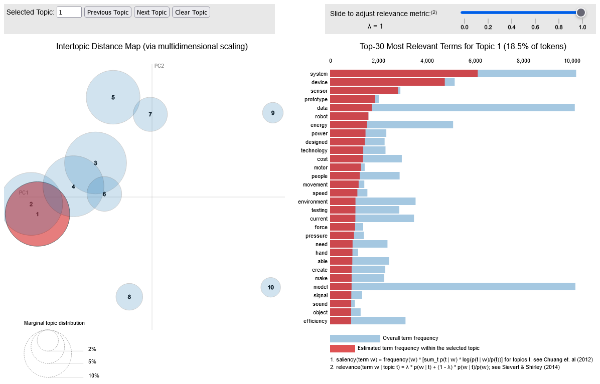

# Regeneron ISEF Explorer

This project features scripts and notebooks to scrape and analyze previous Regeneron ISEF projects.

## Roadmap

| Short Title                         | Goal                                                                                                                                           | Methods                                                                                                                                                                                                                                                                                                                                                                                                                                                         |
| ----------------------------------- | ---------------------------------------------------------------------------------------------------------------------------------------------- | --------------------------------------------------------------------------------------------------------------------------------------------------------------------------------------------------------------------------------------------------------------------------------------------------------------------------------------------------------------------------------------------------------------------------------------------------------------- |
| ✅ Multi-dimensional Topic Analysis | Uncover latent themes and trends in ISEF projects over time, identifying patterns in research focus across different categories and countries. | Applied Latent Dirichlet Allocation (LDA) to the dataset, particularly focusing on project abstracts. Implemented temporal analysis to track topic evolution over years. Used categorical analysis to compare topic distributions across different project categories and countries. Likely employed perplexity and coherence scores to optimize the number of topics, and visualized results using techniques like pyLDAvis for interactive topic exploration. |
| Predictive Success Modeling         | Develop a model to predict the likelihood of a project winning awards based on its characteristics.                                            | Use ensemble methods like Random Forests or Gradient Boosting Machines. Features would include text embeddings of abstracts, categorical encodings of project details, and engineered features capturing temporal trends. Implement cross-validation and feature importance analysis to ensure model robustness and interpretability.                                                                                                                           |
| Research Trajectory Analysis        | Identify common research trajectories and evolution of topics over time within each category.                                                  | Apply dynamic topic modeling, an extension of LDA that incorporates time as a variable. Implement a custom version using PyTorch to handle the temporal aspect of the data. Visualize topic evolution using streamgraphs or ThemeRiver diagrams.                                                                                                                                                                                                                |
| Collaboration Network Mapping       | Analyze patterns of collaboration among researchers and institutions across different projects.                                                | Construct a graph database using Neo4j to represent researchers, institutions, and projects as nodes with various relationships. Apply community detection algorithms and centrality measures to identify key players and clusters in the research ecosystem. Visualize the network using tools like Gephi or custom D3.js visualizations.                                                                                                                      |
| Cross-Cultural Innovation Index     | Develop a metric to quantify and compare innovation trends across different countries and regions.                                             | Implement a custom scoring system using a combination of NLP techniques (e.g., novelty detection in abstracts) and statistical measures (e.g., diversity of categories, award rates). Use time series analysis techniques like ARIMA or Prophet to forecast future trends. Validate the index through correlation analysis with external innovation metrics.                                                                                                    |
| Automated Project Feedback System   | Create a system that can provide constructive feedback on project abstracts based on historical data.                                          | Fine-tune a large language model (e.g., BERT or GPT) on the dataset of successful project abstracts. Implement a retrieval-augmented generation approach to provide context-aware suggestions. Develop a custom metric to evaluate the quality and relevance of generated feedback, potentially using reinforcement learning to optimize the system over time.                                                                                                  |
